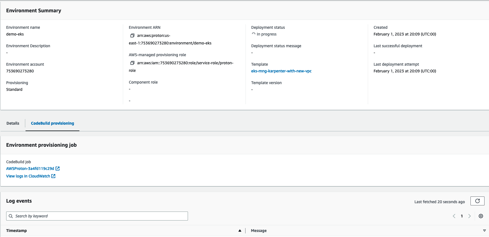
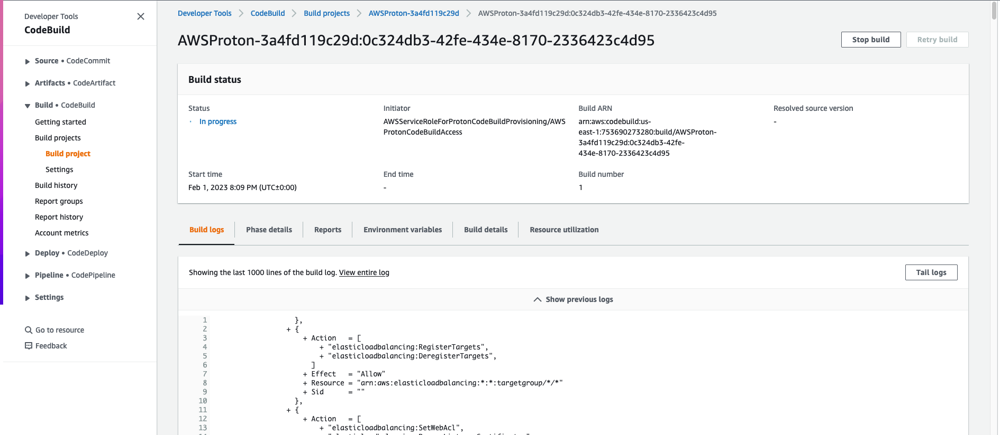

#### What is the goal of this tutorial?

This repository includes a template example to configure AWS Proton as a vending machine for EKS clusters using Terraform. For more information about this use case please read this [blog post](https://aws.amazon.com/blogs/containers/using-aws-proton-as-a-provisioning-mechanism-for-amazon-eks-clusters/). This tutorial is not intended to be used as-is for production. It provides an example of how to use Proton for this specific scenario. The template is only provided to describe "the art of possible".

#### Getting started and one-off configurations

To get started with this tutorial you need to have an AWS account with administrative privileges and a GitHub account.

> Note: Terraform provisioning happens outside the context of Proton and for that we are providing a sample GitHub Actions workflow as part of the same repository. However, you could use any Terraform pipeline you want to accomplish the same result with a similar flow.

Login to the AWS console and select the AWS region where you want to exercise this tutorial.  

Create a repository (in your GitHub account) off of this template: https://github.com/aws-samples/eks-blueprints-for-proton and keep the same name (you can also fork the repository if you prefer). Remember to enable GitHub Actions on your repository because it will be required later.  

Set up an AWS CodeStar connection following [these instructions](https://docs.aws.amazon.com/proton/latest/adminguide/setting-up-for-service.html#setting-up-vcontrol). This will allow you to access your GitHub account (and your repos) from Proton.

Once you are done, go to the Proton console and switch to the `Settings/Repositories` page. Add the repository you created (or forked) above and point to the `main` branch. You should now have a repository listed that looks like this (your GitHub name will be different):


- Create s3 bucket for terraform state and IAM user.
   -  Prior to running Terraform in Proton, you'll need a place to store Terraform state. For the examples, you'll use an AWS S3 bucket for this purpose.
   - You also need a IAM user `protondev`
   Create s3bucket and IAM user  using the Terraform configuration located in the [bootstrap](./bootstrap/README.md) directory.

#### Create the environment template in Proton

Now that you configured the core requirements in your accounts, create the environment template that Proton will use to vend clusters.

> To do so we will continue to use the administrative user or role we have used so far in the tutorial. Some customers may want this part to be done by Proton administrators (i.e. entities with the `AWSProtonFullAccess` IAM policy associated or a variation of it).  

Switch to the `Templates/Environment templates` page in the Proton console and click `Create environment template`. Leave all defaults except for the following fields: (1) in the `Template bundle source` select `Sync templates from Git`; (2) Pick the repository in your account; (3) set the Branch name to main; (4) in the Template details set `eks-mng-karpenter-with-new-vpc` as the `Template name`.

> It is important that you set the name exactly to `eks-mng-karpenter-with-new-vpc` because Proton will scan the repo for that exact folder name (and version structure).

Set a `Template display name` for convenience and an optional description; leave everything else as default and click `Create environment template`.

Within a few seconds, upon a refresh, you should see a template version `1.0` appear. It's in `Draft` state. Click `Publish` and it will move into `Published` state.

You should see something like this:


#### Deploy the cluster via Proton

Now that a platform administrator has configured the template that represents the organization standard for an EKS cluster, logout from the console with the administrative principle and login back with the `protondev` user you created earlier.

 

Navigate to the `Environments` page in the Proton console and click `Create environment`. Select the environment template you created above and click `Configure`. 

- Enter the value for `Environment name`
- In `AWS-managed provisioning role` 
   - select option `AWS-managed provisioning role`
- Enter the value for `CodeBuild provisioning role`
- Click 'Next' button

You will see the EKS input variable form
- Give your cluster a name, leave the vpc_cidr as is 
- Add your AWS IAM user (protondev) to the input user 
- Add Terraform state storage S3 bucket name. 
- Add Terraform state storage S3 bucket

You should now see something like this:


The EKS Blueprints will enable the user you enter to assume an IAM role that has been defined as a Kubernetes cluster admin in the K8s RBAC (we'll play with this later). The list of add-ons has been provided as an example. Flag or unflag them at your discretion. Should you use this solution in production you may want to check in the EKS Blueprints all the add-ons supported and include what you need in your own Proton template. For example, you may want to expose the size of the cluster either in terms of nodes (min, max) or in t-shirt sizes (small, medium, large). This example template hard code the size of the cluster, but it's really all up to the platform team to decide what parameters to expose to developers.

This is where the magic happens. The input parameters you see here (which are obviously related to the EKS cluster you are about to provision) are part of the sample template provided in the repo but that you can fully customize based on your needs. Specifically the [main.tf](https://github.com/aws-samples/eks-blueprints-for-proton/blob/main/templates/eks-mng-karpenter-with-new-vpc/v1/infrastructure/main.tf) file is where the [EKS Blueprints](https://github.com/aws-ia/terraform-aws-eks-blueprints/blob/main/docs/getting-started.md) module is imported and where the core configuration is defined. The [schema.yaml](https://github.com/aws-samples/eks-blueprints-for-proton/blob/main/templates/eks-mng-karpenter-with-new-vpc/v1/schema/schema.yaml) file is where all the inputs get defined. The [outputs.tf](https://github.com/aws-samples/eks-blueprints-for-proton/blob/main/templates/eks-mng-karpenter-with-new-vpc/v1/infrastructure/outputs.tf) file is where all the outputs that will be presented in the Proton console get defined. Note that in the template sample we created in the repo the only Kubernetes version you can pick is 1.20 because we pretend that this is the only version that the platform team at your org has vetted and is supporting internally.

Click `Next` and in the next summary form click `Create`. This will kick off your cluster creation.

This will trigger the codepipeline to provision the infrostructure.

You can get the codepipeline link on environment dahsboard like this




Click the above link to check the build logs




 It will take roughly 15/20 minutes to deploy, and you can watch progress in the GitHub Actions workflow. When the workflow completes you should see something like this in your Proton console for the environment you have just deployed:


Congratulations. You have just witnessed Proton vending an EKS cluster.

#### Interacting with the cluster

You should still be logged in as `protondev`. You can now open a Cloud Shell and run the `aws eks update-kubeconfig` command as reported in the Proton `Outputs` section. This will configure `kubectl` in your shell to communicate with this cluster. If you have `kubectl` installed in your shell you can start interacting with the cluster (you can grab the `kubectl` binary from [here](https://kubernetes.io/docs/tasks/tools/install-kubectl-linux/)):

```
[cloudshell-user@ip-10-0-70-52 ~]$
[cloudshell-user@ip-10-0-70-52 ~]$ aws eks --region us-west-2 update-kubeconfig --name 6946-myekscluster --role-arn arn:aws:iam::336419811389:role/6946-aws001-preprod-dev-platform-team-Access
Added new context arn:aws:eks:us-west-2:336419811389:cluster/6946-myekscluster to /home/cloudshell-user/.kube/config

[cloudshell-user@ip-10-0-70-52 ~]$ kubectl get pods -A
NAMESPACE        NAME                                            READY   STATUS    RESTARTS   AGE
NAMESPACE            NAME                                           READY   STATUS    RESTARTS   AGE
aws-for-fluent-bit   aws-for-fluent-bit-42954                       1/1     Running   0          103m
aws-for-fluent-bit   aws-for-fluent-bit-9srpk                       1/1     Running   0          103m
aws-for-fluent-bit   aws-for-fluent-bit-rzj9m                       1/1     Running   0          103m
cert-manager         cert-manager-5dbb9d7955-tcrfp                  1/1     Running   0          103m
cert-manager         cert-manager-cainjector-7d55bf8f78-s54mm       1/1     Running   0          103m
cert-manager         cert-manager-webhook-5c888754d5-rsw5f          1/1     Running   0          103m
karpenter            karpenter-7b9cc6dc5b-wrdlz                     2/2     Running   0          104m
kube-system          aws-load-balancer-controller-7686bcf8b-bp7rv   1/1     Running   0          104m
kube-system          aws-load-balancer-controller-7686bcf8b-m47m6   1/1     Running   0          104m
kube-system          aws-node-52hmg                                 1/1     Running   0          105m
kube-system          aws-node-bxqt5                                 1/1     Running   0          105m
kube-system          aws-node-zmhrr                                 1/1     Running   0          105m
kube-system          coredns-86d9946576-5g46r                       1/1     Running   0          106m
kube-system          coredns-86d9946576-vrldf                       1/1     Running   0          106m
kube-system          kube-proxy-f5ph4                               1/1     Running   0          105m
kube-system          kube-proxy-nzwbj                               1/1     Running   0          105m
kube-system          kube-proxy-qz55d                               1/1     Running   0          105m
kube-system          metrics-server-679944f8f6-264jl                1/1     Running   0          104m
vpa                  vpa-recommender-fb896949d-xnknm                1/1     Running   0          104m
vpa                  vpa-updater-7447f7657-9zkwc                    1/1     Running   0          104m

[cloudshell-user@ip-10-0-70-52 ~]$ kubectl get nodes
NAME                                        STATUS   ROLES    AGE    VERSION
ip-10-0-10-125.us-west-2.compute.internal   Ready    <none>   105m   v1.20.11-eks-f17b81
ip-10-0-11-68.us-west-2.compute.internal    Ready    <none>   105m   v1.20.11-eks-f17b81
ip-10-0-12-132.us-west-2.compute.internal   Ready    <none>   105m   v1.20.11-eks-f17b81

[cloudshell-user@ip-10-0-70-52 ~]$ kubectl cluster-info
Kubernetes control plane is running at https://FEEEFE9EC8CE64A2F90269827F8CB045.gr7.us-west-2.eks.amazonaws.com
CoreDNS is running at https://FEEEFE9EC8CE64A2F90269827F8CB045.gr7.us-west-2.eks.amazonaws.com/api/v1/namespaces/kube-system/services/kube-dns:dns/proxy

To further debug and diagnose cluster problems, use 'kubectl cluster-info dump'.

[cloudshell-user@ip-10-0-70-52 ~]$ kubectl version
Client Version: version.Info{Major:"1", Minor:"23", GitVersion:"v1.23.5", GitCommit:"c285e781331a3785a7f436042c65c5641ce8a9e9", GitTreeState:"clean", BuildDate:"2022-03-16T15:58:47Z", GoVersion:"go1.17.8", Compiler:"gc", Platform:"linux/amd64"}
Server Version: version.Info{Major:"1", Minor:"20+", GitVersion:"v1.20.15-eks-14c7a48", GitCommit:"eb09fc479c1b2bfcc35c47416efb36f1b9052d58", GitTreeState:"clean", BuildDate:"2022-04-01T03:14:50Z", GoVersion:"go1.15.15", Compiler:"gc", Platform:"linux/amd64"}
WARNING: version difference between client (1.23) and server (1.21) exceeds the supportedhttps://docs.aws.amazon.com/IAM/latest/UserGuide/id_roles_use_switch-role-console.html minor version skew of +/-1
[cloudshell-user@ip-10-0-70-52 ~]$
```
From now on it's just standard Kubernetes.

You can also access the cluster via the AWS console. To do so you need to assume the role that has been added to the K8s RBAC. The `protondev` user is allowed to assume that role (this is what we have done with the `aws eks update-kubeconfig` command above). In our example this role is `arn:aws:iam::336419811389:role/6946-aws001-preprod-dev-platform-team-Access` (available as part of the command string in the Proton environment output). In the console, while logged as `protondev` you can [switch to this role](https://docs.aws.amazon.com/IAM/latest/UserGuide/id_roles_use_switch-role-console.html), move to the EKS console and navigate in the UI to discover all cluster objects:  


> Fun fact: the developer may see an `Update now` button in the console if there is a new Kubernetes cluster version available in EKS. While the `arn:aws:iam::336419811389:role/6946-aws001-preprod-dev-platform-team-Access` role is a Kubernetes administrator (in other words you can do pretty much all you want with kubectl), it has very limited IAM permissions when it comes to EKS (mostly limited to list and describe operations). This is why you can use the console to list, describe the cluster and discover all objects in it. Simply put, clicking on the `Update now` button will just generate a message saying the operation cannot be performed.  

How do you maintain this cluster then? We are glad you asked.

#### Updating the Proton cluster template

Remember this solution allows a central platform team to maintain a set of standards (one of which is the Kubernetes cluster version). As a platform administrator you may get to the point where you bless another Kubernetes version. In this case let's simulate that you have verified K8s version `1.21` adheres to your organization standards, and you want to make it available to you developers. The only thing you need to do is to update the [schema.yaml](https://github.com/aws-samples/eks-blueprints-for-proton/blob/main/templates/eks-mng-karpenter-with-new-vpc/v1/schema/schema.yaml) file in your own repository (the repository you are using with Proton) to include the new version. Specifically you need to configure the `kubernetes_version` variable to accept both `1.20` and `1.21` and change the default to `1.21` as follows:
```
        kubernetes_version:
          type: string
          description: Kubernetes Version
          enum: ["1.23", "1.24"]
          default: "1.24"
```

When you push this commit to your repository in GitHub, Proton will detect the change in the template. If you login with the administrative user you will see in the details of your `Environment template` that there is a new version in the `Draft` stage. You can click `Publish`, and it will become the new default minor version for that template.

This means that every cluster a developer will deploy with this template can be deployed with either versions (because `1.23` and `1.24` are both valid options). However, it is also possible to upgrade an existing 1.23 cluster to the new 1.24 version.

Your environment template should now look like this:


> Note the new `Template version` (`1.1`) and also note that there is an environment deployed that references this template at version `1.0`.

#### Updating an existing cluster

Now that a Proton administrator have updated the template, login back as the `protondev` user and open your Proton environment that represents the cluster you deployed above. You will notice that there is a message, in the `Template version` field, that says that there is a new template available. You can now update your environment to apply the new template and change the inputs.

> Note: in this example we are updating both the template and an input parameter in that template. In general these can be separate processes. That is, you can update the template functionalities without necessarily exposing the user new or different parameters, or you can update input parameters without having to update a template. Refer to [this Proton documentation page](https://docs.aws.amazon.com/proton/latest/adminguide/ag-env-update.html) for more details about environments updates. Also remember that this EKS Blueprint template is only provided as part of a demonstration tutorial. If you are deep into Terraform and EKS/Kubernetes you can build a template that better fits your own needs. Refer to the [EKS Blueprints repo](https://github.com/aws-ia/terraform-aws-eks-blueprints/blob/main/docs/getting-started.md) for all the options available.

In our scenario, you have to go to the Proton environment and click `Update minor`:


At the next screen leave everything unchanged and click `Edit` to get access and update your cluster parameters. Here you can set the cluster version to 1.24:


Click `Next` and then `Update`.

This will trigger a workflow identical to the one we triggered with the deployment. Terraform, in this case, will `apply` the configuration to an existing cluster and the logic inside the EKS Blueprints module will know how to upgrade an EKS cluster. At the end of this process the GitHub action will notify Proton that the upgrade has completed.

Please note that Kubernetes versions are a moving target. The examples in this README file refer to setting up version 1.23 and upgrading it to 1.24. Over time, your setup will require to use new EKS Blueprints module versions (as defined in the [main.tf](https://github.com/aws-samples/eks-blueprints-for-proton/blob/main/templates/eks-mng-karpenter-with-new-vpc/v1/infrastructure/main.tf) file and different Kubernetes cluster versions as defined in the [schema.yaml](https://github.com/aws-samples/eks-blueprints-for-proton/blob/main/templates/eks-mng-karpenter-with-new-vpc/v1/schema/schema.yaml) file.

> Note: Kubernetes cluster upgrades are often heavy operations that have ramifications into add-on components and modules you use. In some cases they also have ramifications into how applications running on Kubernetes are defined. While EKS Blueprints help in that regard, it's important that you test these upgrades throughout. Also consider that there are a number of strategies you can use to surface Kubernetes versions in your Proton templates. In our quick example we have shown how to have multiple Kubernetes versions in the same template but another tactic could be to separate Kubernetes versions in dedicated Proton major template versions (in a 1:1 mapping between the Kubernetes version and the Proton template major version). Each approach has advantages and disadvantages that you need to factor in. You can read more about Proton templates versions [here](https://docs.aws.amazon.com/proton/latest/adminguide/ag-template-versions.html).  

#### Deleting the cluster
When you are done with the test you may want to delete the cluster to avoid incurring into undesired infrastructure costs. From the Proton console go into the environment you have deployed and select Delete. 