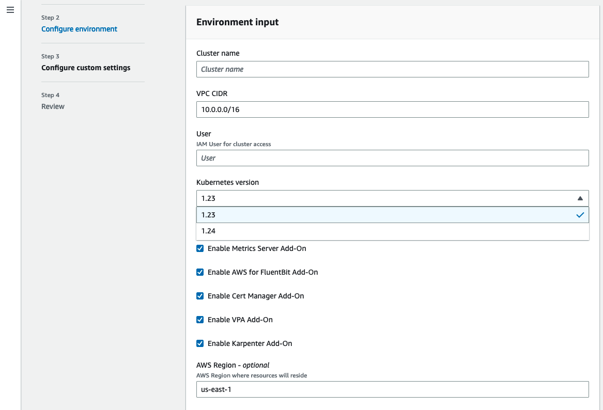

#### What is the goal of this tutorial?

This repository includes a template example to configure AWS Proton as a vending machine for EKS cluster using Terraform. For more information about this use case please read this [blog post](). This tutorial is not intended to be used as-is for production. It provides an example of how to use Proton for this specific scenario. The template is only provided to describe "the art of possible". 

#### Getting started and one-off configurations 

To get started with this tutorial you need to have an AWS account with administrative privileges and a GitHub account.

> Note: Terraform provisioning happens outside the context of Proton and for that we are providing a sample GitHub Actions workflow as part of the same repository. However, you could use any Terraform pipeline you want to accomplish the same result with a similar flow.

Login to the AWS console and select the AWS region where you want to exercise this tutorial.  

Create a repository (in your GitHub account) off of this template: https://github.com/aws-samples/eks-blueprints-for-proton and keep the same name (you can also fork the repository if you prefer). Remember to enable GitHub Actions on your repository because it will be required later.  

Set up an AWS CodeStar connection following [these instructions](https://docs.aws.amazon.com/proton/latest/adminguide/setting-up-for-service.html#setting-up-vcontrol). This will allow you to access your GitHub account (and your repos) from Proton.

Once you are done, go to the Proton console and switch to the `Settings/Repositories` page. Add the repository you created (or forked) above and point to the `main` branch. You should now have a repository listed that looks like this (your GitHub name will be different): 


For Terraform to be able to deploy (or "vend") EKS clusters, it needs to assume a proper IAM role. In addition, since for our solution we will use Terraform open source, we also need an S3 bucket to save the Terraform state. To do this please follow the instructions [at this page](./scripts/README.md).

Retrieve the role ARN and the S3 bucket name from the output of the IaC above and update the [env-config.json](./env_config.json) file in your GitHub repository. Make sure to update the `region` parameter to the region you are using.

> Remember to commit and push these changes to your GitHub repository now

Create an IAM user that you will be using to represent the developer persona (i.e. the person that will request the cluster). Call it `protondev` and attach the AWS managed `AWSProtonDeveloperAccess` policy.

This user needs a bit more power in addition to the managed `AWSProtonDeveloperAccess` IAM policy. 

Because, in Proton, a developer with the standard `AWSProtonDeveloperAccess` is not allowed to deploy an environment, you need to add the ability to `CreateEnvironment`, `UpdateEnvironment`, `DeleteEnvironment` as well as to `PassRole` (to the Proton service). In addition, to use the `aws eks update-kubeconfig` command to create the `config` file that kubectl will use, the `protondev` must be able to `DescribeCluster`. Lastly, for convenience if you want to use the Cloud Shell with the `protondev` user, that policy must be allowed explicitly.  

The following is an inline policy for the `protondev` user to add these additional permissions required: 
```
{
    "Version": "2012-10-17",
    "Statement": [
        {
            "Effect": "Allow",
            "Action": "iam:PassRole",
            "Resource": "*",
            "Condition": {
                "StringEquals": {
                    "iam:PassedToService": "proton.amazonaws.com"
                }
            }
        },
        {
            "Effect": "Allow",
            "Action": [
                "proton:CreateEnvironment",
                "proton:UpdateEnvironment",
                "proton:DeleteEnvironment",
                "iam:ListRoles"
            ],
            "Resource": "*"
        },
        {
            "Effect": "Allow",
            "Action": "eks:DescribeCluster",
            "Resource": "*"
        },
        {
            "Effect": "Allow",
            "Action": "cloudshell:*",
            "Resource": "*"
        }
    ]
}
```

#### Create the environment template in Proton

Now that you configured the core requirements in your accounts, create the environment template that Proton will use to vend clusters. 

> To do so we will continue to use the administrative user or role we have used so far in the tutorial. Some customers may want this part to be done by Proton administrators (i.e. entities with the `AWSProtonFullAccess` IAM policy associated or a variation of it).  

Switch to the `Templates/Environment templates` page in the Proton console and click `Create environment template`. Leave all defaults except for a few fields. In the `Template bundle source` select `Sync templates from Git`. Pick the repository in your account, set the Branch name to main. In the Template details set `eks-mng-karpenter-with-new-vpc` as the `Template name`.

> It is important that you set the name exactly to `eks-mng-karpenter-with-new-vpc` because Proton will scan the repo for that exact folder name (and version structure).

Set a `Template display name` for convenience and an optional description; leave everything else as default and click `Create environment template`.

Within a few seconds, upon a refresh, you should see a template version `1.0` appear. It's in `Draft` state. Click `Publish` and it will move into `Published` state.

You should see something like this:


#### Deploy the cluster via Proton

Now that a platform administrator has configured the template that represents the organization standard for an EKS cluster, logout from the console with the administrative principle and login back with the `protondev` user you created earlier. 

> Before moving forward double-check that GitHub Actions are enabled for your repository because the next steps will eventually trigger the workflows.

Navigate to the `Environments` page in the Proton console and click `Create environment`. Select the environment template you created above and click `Configure`. In the `Provisioning` section select `Self-managed provisioning`. In the `Provisioning repository details` select `Existing repository`, in the `Repository name` select the GitHub repo you created (or forked) above and `main` as the `Branch name`. Provide an `Environment name`, an optional `Environment description` of your choice and click `Next`.

Give your cluster a name, leave the vpc_cidr as is and add your AWS IAM user (`protondev`) to the input `user`. You should now see something like this:


The EKS Blueprints will enable the user you enter to assume an IAM role that has been defined as a Kubernetes cluster admin in the K8s RBAC (we'll play with this later). The list of add-ons has been provided as an example. Flag or unflag them at your discretion. Should you use this solution in production you may want to check in the EKS Blueprints all the add-ons supported and include what you need in your own Proton template. For example, you may want to expose the size of the cluster either in terms of nodes (min, max) or in t-shirt sizes (small, medium, large). This example template hard code the size of the cluster, but it's really all up to the platform team to decide what parameters to expose to developers.

This is where the magic happens. The input parameters you see here (which are obviously related to the EKS cluster you are about to provision) are part of the sample template provided in the repo but that you can fully customize based on your needs. Specifically the [main.tf](https://github.com/aws-samples/eks-blueprints-for-proton/blob/main/templates/eks-mng-karpenter-with-new-vpc/v1/infrastructure/main.tf) file is where the [EKS Blueprints](https://github.com/aws-ia/terraform-aws-eks-blueprints/blob/main/docs/getting-started.md) module is imported and where the core configuration is defined. The [schema.yaml](https://github.com/aws-samples/eks-blueprints-for-proton/blob/main/templates/eks-mng-karpenter-with-new-vpc/v1/schema/schema.yaml) file is where all the inputs get defined. The [outputs.tf](https://github.com/aws-samples/eks-blueprints-for-proton/blob/main/templates/eks-mng-karpenter-with-new-vpc/v1/infrastructure/outputs.tf) file is where all the outputs that will be presented in the Proton console get defined. Note that in the template sample we created in the repo the only Kubernetes version you can pick is 1.21 because we pretend that this is the only version that the platform team at your org has vetted and is supporting internally.

Click `Next` and in the next summary form click `Create`. This will kick off your cluster creation. 

This will trigger the following process:
- Proton will merge the Terraform template with your inputs and create a PR in the repository you specified (in our tutorial it's the same repository that hosts the template, but you probably want these to be two separate repositories in a production setup - just remember to add them both to the Proton `Repositories` page you configured at the beginning)
- The [GitHub action example that ships with this repository](.github/workflows/proton-run.yml) will trigger to run a plan and check everything is in good shape 
- The PR will be created (its merging can be a manual step performed by a platform administrator upon a code review or, because Proton creates enough guardrails for the PR to be legit, the repository can be configured to perform an auto-merge)
- Once the PR is merged the GH action provided as an example in the repository will kick off again and this time it will go till the `terraform apply` stage effectively deploying the cluster 
- When the `apply` has completed the action will notify Proton with the `output` which consists, among other things, of the `eks aws` command to configure the `config` file to point `kubectl` to the cluster you just deployed. 

> Note: if you want to know more about how Terraform templating and Git provisioning works in Proton, please refer to these two blogs posts: [AWS Proton Terraform Templates](https://aws.amazon.com/blogs/containers/aws-proton-terraform-templates/) and [AWS Proton Self-Managed Provisioning](https://aws.amazon.com/blogs/containers/aws-proton-self-managed-provisioning/). 

It will take roughly 15/20 minutes to deploy, and you can watch progress in the GitHub Actions workflow. When the workflow completes you should see something like this in your Proton console for the environment you have just deployed: 

 

Congratulations. You have just witnessed Proton vending an EKS cluster.

#### Interacting with the cluster

You should still be logged in as `protondev`. You can now open a Cloud Shell and run the `aws eks update-kubeconfig` command as reported in the Proton `Outputs` section. This will configure `kubectl` in your shell to communicate with this cluster. If you have `kubectl` installed in your shell you can start interacting with the cluster (you can grab the `kubectl` binary from [here](https://kubernetes.io/docs/tasks/tools/install-kubectl-linux/)): 

```
[cloudshell-user@ip-10-0-70-52 ~]$ 
[cloudshell-user@ip-10-0-70-52 ~]$ aws eks --region us-west-2 update-kubeconfig --name 6946-myekscluster --role-arn arn:aws:iam::336419811389:role/6946-aws001-preprod-dev-platform-team-Access
Added new context arn:aws:eks:us-west-2:336419811389:cluster/6946-myekscluster to /home/cloudshell-user/.kube/config

[cloudshell-user@ip-10-0-70-52 ~]$ ./kubectl get pods -A
NAMESPACE        NAME                                            READY   STATUS    RESTARTS   AGE
cert-manager     cert-manager-646968b67-tj6zd                    1/1     Running   0          103m
cert-manager     cert-manager-cainjector-7d55bf8f78-k6p2w        1/1     Running   0          103m
cert-manager     cert-manager-webhook-577f77586f-gm8n8           1/1     Running   0          103m
karpenter        karpenter-85c577b548-rvf8b                      2/2     Running   0          104m
kube-system      aws-load-balancer-controller-568fc98559-bzdr4   1/1     Running   0          104m
kube-system      aws-load-balancer-controller-568fc98559-t5lkm   1/1     Running   0          104m
kube-system      aws-node-mq68h                                  1/1     Running   0          103m
kube-system      coredns-6968c9cbb-fvt7n                         1/1     Running   0          104m
kube-system      coredns-6968c9cbb-ps2j6                         1/1     Running   0          104m
kube-system      kube-proxy-rskv4                                1/1     Running   0          104m
logging          aws-for-fluent-bit-b4dpz                        1/1     Running   0          103m
metrics-server   metrics-server-694d47d564-wb5jv                 1/1     Running   0          104m
vpa              vpa-recommender-554f56647b-pq2g5                1/1     Running   0          104m
vpa              vpa-updater-67d6c5c7cf-b2hsd                    1/1     Running   0          104m

[cloudshell-user@ip-10-0-70-52 ~]$ ./kubectl get nodes
NAME                                        STATUS   ROLES    AGE    VERSION
ip-10-0-11-250.us-west-2.compute.internal   Ready    <none>   105m   v1.21.5-eks-9017834

[cloudshell-user@ip-10-0-70-52 ~]$ ./kubectl cluster-info
Kubernetes control plane is running at https://FEEEFE9EC8CE64A2F90269827F8CB045.gr7.us-west-2.eks.amazonaws.com
CoreDNS is running at https://FEEEFE9EC8CE64A2F90269827F8CB045.gr7.us-west-2.eks.amazonaws.com/api/v1/namespaces/kube-system/services/kube-dns:dns/proxy

To further debug and diagnose cluster problems, use 'kubectl cluster-info dump'.

[cloudshell-user@ip-10-0-70-52 ~]$ ./kubectl version
Client Version: version.Info{Major:"1", Minor:"23", GitVersion:"v1.23.5", GitCommit:"c285e781331a3785a7f436042c65c5641ce8a9e9", GitTreeState:"clean", BuildDate:"2022-03-16T15:58:47Z", GoVersion:"go1.17.8", Compiler:"gc", Platform:"linux/amd64"}
Server Version: version.Info{Major:"1", Minor:"21+", GitVersion:"v1.21.9-eks-0d102a7", GitCommit:"eb09fc479c1b2bfcc35c47416efb36f1b9052d58", GitTreeState:"clean", BuildDate:"2022-02-17T16:36:28Z", GoVersion:"go1.16.12", Compiler:"gc", Platform:"linux/amd64"}
WARNING: version difference between client (1.23) and server (1.21) exceeds the supportedhttps://docs.aws.amazon.com/IAM/latest/UserGuide/id_roles_use_switch-role-console.html minor version skew of +/-1
[cloudshell-user@ip-10-0-70-52 ~]$ 
```
From now on it's just standard Kubernetes. 

You can also access the cluster via the AWS console. To do so you need to assume the role that has been added to the K8s RBAC. The `protondev` user is allowed to assume that role (this is what we have done with the `aws eks update-kubeconfig` command above). In our example this role is `arn:aws:iam::336419811389:role/6946-aws001-preprod-dev-platform-team-Access` (available as part of the command string in the Proton environment output). In the console, while logged as `protondev` you can [switch to this role](https://docs.aws.amazon.com/IAM/latest/UserGuide/id_roles_use_switch-role-console.html), move to the EKS console and navigate in the UI to discover all cluster objects:  


> Fun fact: the developer may see an `Update now` button in the console if there is a new Kubernetes cluster version available in EKS. While the `arn:aws:iam::336419811389:role/6946-aws001-preprod-dev-platform-team-Access` role is a Kubernetes administrator (in other words you can do pretty much all you want with kubectl), it has very limited IAM permissions when it comes to EKS (mostly limited to list and describe operations). This is why you can use the console to list, describe the cluster and discover all objects in it. Simply put, clicking on the `Update now` button will just generate a message saying the operation cannot be performed.    

How do you maintain this cluster then? We are glad you asked. 

#### Updating the Proton cluster template

Remember this solution allows a central platform team to maintain a set of standards (one of which is the Kubernetes cluster version). As a platform administrator you may get to the point where you bless another Kubernetes version. In this case let's simulate that you have verified K8s version `1.22` adheres to your organization standards, and you want to make it available to you developers. The only thing you need to do is to update the [schema.yaml](https://github.com/aws-samples/eks-blueprints-for-proton/blob/main/templates/eks-mng-karpenter-with-new-vpc/v1/schema/schema.yaml) file in your own repository (the repository you are using with Proton) to include the new version. Specifically you need to configure the `kubernetes_version` variable to accept both `1.21` and `1.22` and change the default to `1.22` as follows: 
```
        kubernetes_version:
          type: string
          description: Kubernetes Version
          enum: ["1.21", "1.22"]
          default: "1.22"
```

When you push this commit to your repository in GitHub, Proton will detect the change in the template. If you login with the administrative user you will see in the details of your `Environment template` that there is a new version in the `Draft` stage. You can click `Publish`, and it will become the new default minor version for that template. 

This means that every cluster a developer will deploy with this template can be deployed with either versions (because `1.21` and `1.22` are both valid options). However, it is also possible to upgrade an existing 1.21 cluster to the new 1.22 version. 

Your environment template should now look like this: 


> Note the new `Template version` (`1.1`) and also note that there is an environment deployed that references this template at version `1.0`.

#### Updating an existing cluster

Now that a Proton administrator have updated the template, login back as the `protondev` user and open your Proton environment that represents the cluster you deployed above. You will notice that there is a message, in the `Template version` field, that says that there is a new template available. You can now update your environment to apply the new template and change the inputs. 

> Note: in this example we are updating both the template and an input parameter in that template. In general these can be separate processes. That is, you can update the template functionalities without necessarily exposing the user new or different parameters, or you can update input parameters without having to update a template. Refer to [this Proton documentation page](https://docs.aws.amazon.com/proton/latest/adminguide/ag-env-update.html) for more details about environments updates. Also remember that this EKS Blueprint template is only provided as part of a demonstration tutorial. If you are deep into Terraform and EKS/Kubernetes you can build a template that better fits your own needs. Refer to the [EKS Blueprints repo](https://github.com/aws-ia/terraform-aws-eks-blueprints/blob/main/docs/getting-started.md) for all the options available.

In our scenario, you have to go to the Proton environment and click `Update minor`: 


At the next screen leave everything unchanged and click `Edit` to get access and update your cluster parameters. Here you can set the cluster version to 1.22:



Click `Next` and then `Update`. 

This will trigger a workflow identical to the one we triggered with the deployment. Terraform, in this case, will `apply` the configuration to an existing cluster and the logic inside the EKS Blueprints module will know how to upgrade an EKS cluster. At the end of this process the GitHub action will notify Proton that the upgrade has completed.

#### Deleting the cluster

When you are done with the test you may want to delete the cluster to avoid incurring into undesired infrastructure costs. From the Proton console go into the environment you have deployed and select `Delete`. This will trigger the same workflow of the deployment and the update. Proton will open a PR against the repository which, when merged, will call the Terraform destroy workflows defined in GitHub Actions.


 